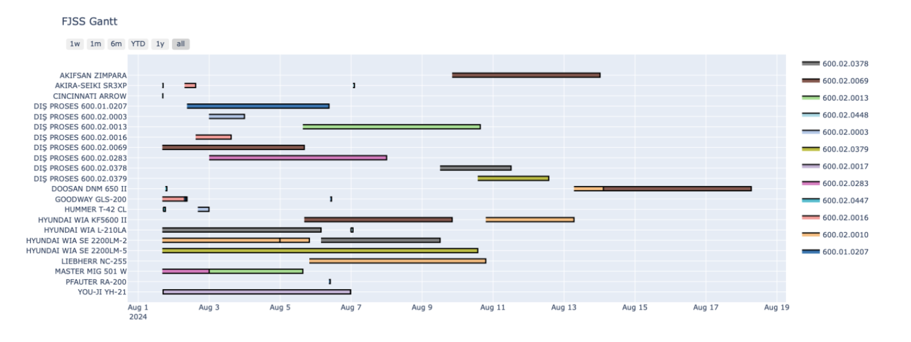
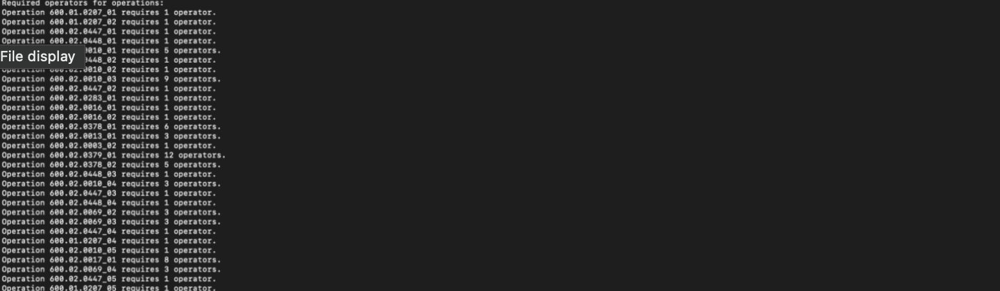

# Flexible Job Shop Scheduling (FJSSP) Solver

This project is a genetic-algorithm-based solver for the Flexible Job Shop Scheduling Problem, built to schedule production orders across a multi-station manufacturing shop floor. Each order is made up of a sequence of operations, and each operation can run on one of several eligible machines with different processing times. The solver searches for a machine assignment and operation order that minimizes makespan, minimizes deadline tardiness, and/or maximizes machine utilization, then renders the resulting schedule as an interactive Gantt chart.

The project was built during an industrial internship; the full write-up, including the methodology and the reasoning behind the design choices, is in `report/AIN300 Internship Report.pdf`.

## How it works

The scheduler (`scheduler.py`) runs a genetic algorithm over a population of candidate schedules. Each individual is encoded as a pair of chromosomes: an operation sequence (`OS`), which is a permutation describing the order in which operations are scheduled, and a machine selection (`MS`), which records which eligible machine is chosen for each operation. This encoding and its initial random population are built in `src/genetic/encoding.py`.

Each generation, the population goes through selection, crossover, and mutation. Selection (`src/genetic/operators/selection.py`) combines elitism, which keeps the best fraction of the population unchanged, with tournament selection for the rest. Crossover (`src/genetic/operators/crossover.py`) recombines the operation sequence using either Precedence Operation Crossover or Job-Based Crossover, chosen at random, and recombines the machine selection with a two-point crossover. Mutation (`src/genetic/operators/mutation.py`) applies swapping or neighborhood mutation to the operation sequence, and a half-mutation operator that reassigns machines for a random subset of operations.

Decoding (`src/genetic/decoding.py`) turns an `(OS, MS)` pair into an actual schedule by placing each operation in the earliest available time slot on its selected machine, respecting the order of operations within a job. Operations longer than 720 minutes are automatically split across additional eligible machines so they can run across multiple shifts. Fitness is evaluated in parallel across all CPU cores using `multiprocessing.Pool`, and the run stops once it reaches `max_gen` generations or once the best fitness stops improving for `max_stagnant_step` consecutive generations.

Once the algorithm converges, the best individual is decoded into a final schedule, checked against order deadlines, and used to estimate how many operators each split operation would require. The example below, taken from the internship report, shows the kind of Gantt chart the solver produces for a real problem instance:



Here is the console output the scheduler prints for the required-operator estimate on the same run, also from the report:



## Project structure

`main.py` is the entry point: it loads `config.json` and `input.json`, runs the scheduler, and exports the results. `scheduler.py` contains the GA main loop. `src/config.py` and `src/utils/parser.py` handle loading the configuration and the problem instance, respectively. The genetic algorithm itself lives in `src/genetic/`: `encoding.py` for chromosome initialization, `decoding.py` for turning a chromosome into a schedule, `objective.py` for the fitness functions, and `operators/` for selection, crossover, and mutation. `src/utils/` holds the output side of things: `gantt.py` builds the interactive Plotly chart, `plot.py` produces the deadline and fitness-convergence plots, `latex.py` exports a LaTeX/TikZ Gantt chart, and `excel_reader/` converts raw planning data from Excel into the `input.json` format the parser expects. `src/append.py` writes the final schedule out to `output.json`. `report/` contains the internship report this project was written for.

## Installation

The project targets Python 3.9+.

```bash
git clone https://github.com/acarbesir/flexible_job_shop_scheduling.git
cd flexible_job_shop_scheduling
pip install -r requirements.txt
```

The main dependencies are `numpy`, `pandas`, `matplotlib`, `plotly`, and `openpyxl`.

## Usage

With `config.json` and `input.json` in the project root, run:

```bash
python main.py
```

This runs the genetic algorithm, prints any orders that missed their deadlines along with the estimated operator counts for each split operation, and opens an interactive Gantt chart of the resulting schedule. It also saves `deadlines_vs_completion_times.png` and `fitness_values_over_generations.png` to the project root. If `latex_export` is set to `true` in `config.json`, it additionally prints a LaTeX/TikZ Gantt chart to stdout and writes `output.json`.

## Configuration

The GA and objective settings live in `config.json`.

| Key | Description |
|---|---|
| `pop_size` | Population size per generation. |
| `max_gen` | Maximum number of generations to run. |
| `pr` | Fraction of the population kept by elitist selection each generation. |
| `pc` | Crossover probability. |
| `pm` | Mutation probability. |
| `latex_export` | If `true`, also export a LaTeX/TikZ Gantt chart and `output.json`. |
| `improvement_threshold` | Minimum fitness improvement needed to reset the stagnation counter. |
| `max_stagnant_step` | Number of stagnant generations before the run stops early. |
| `objective_type` | `0` minimizes makespan, `1` minimizes deadline tardiness, `2` maximizes machine utilization; the weighted combination is meant to be selected here too (see note below). |
| `weight_min_makespan`, `weight_min_deadline_tardiness`, `weight_max_machine_utilization` | Weights used in the weighted objective. |

One thing worth checking if you use the weighted objective: `scheduler.py` builds the weight list when `objective_type` is `3`, but `CalculateFitness` in `src/genetic/objective.py` only routes to the weighted function when `methodIndex` is `4`. As written, setting `objective_type` to `3` will build weights that are never used, and `4` will use the weighted function with an all-zero weight list. Worth reconciling before relying on the weighted mode.

## Input data format

`input.json` has two top-level keys. `machines` is a list of machine records, each with a `machine_id`, `machine_name`, and `machine_availability`. `orders` is a list of jobs, each with a `baca_order_id`, `product_code`, `quantity`, a `deadline` in `DD.MM.YYYY` format, and an ordered list of `operations`. Each operation has an `operation_id`, `operation_type`, `setup_time`, and a list of `available_machines`, each giving a `machine_id` and a `target_cycle_time`.

Operations of type `"Dış Proses"` (external process, i.e. outsourced) are handled a bit differently: the parser assigns them a dedicated virtual machine per product, and they are not split into shifts even if their processing time exceeds 720 minutes, since they represent time spent outside the shop floor.

## Importing data from Excel

If planning data comes from an Excel workbook rather than a hand-written `input.json`, `src/utils/excel_reader` can convert it. It expects a workbook with `orders`, `order_details`, `products`, `operation_cards`, and `stations` sheets, matching the field lists in the corresponding `.py` files in that folder. Running

```bash
cd src/utils/excel_reader
python __init__.py
```

reads and merges those sheets, works out which machines each operation can run on, and writes the result in the same schema that `main.py` and `parser.py` expect.

## Report

`report/AIN300 Internship Report.pdf` is the full internship report this project was written for. It covers the shop floor context the scheduler was built for, the reasoning behind the GA design, and a walkthrough of the results, including the figures reproduced above.

## License

No license file is currently included in this repository.
